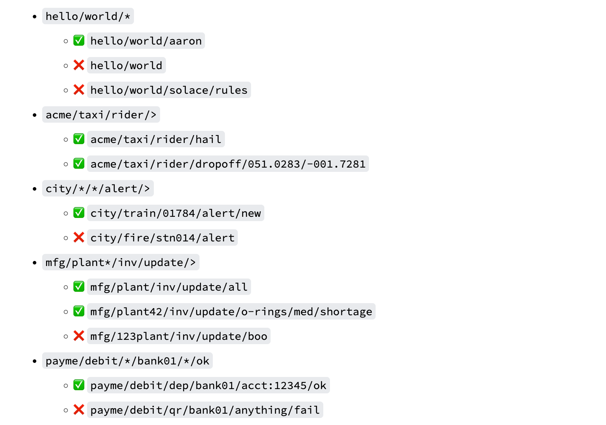
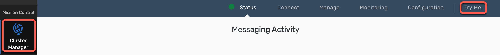
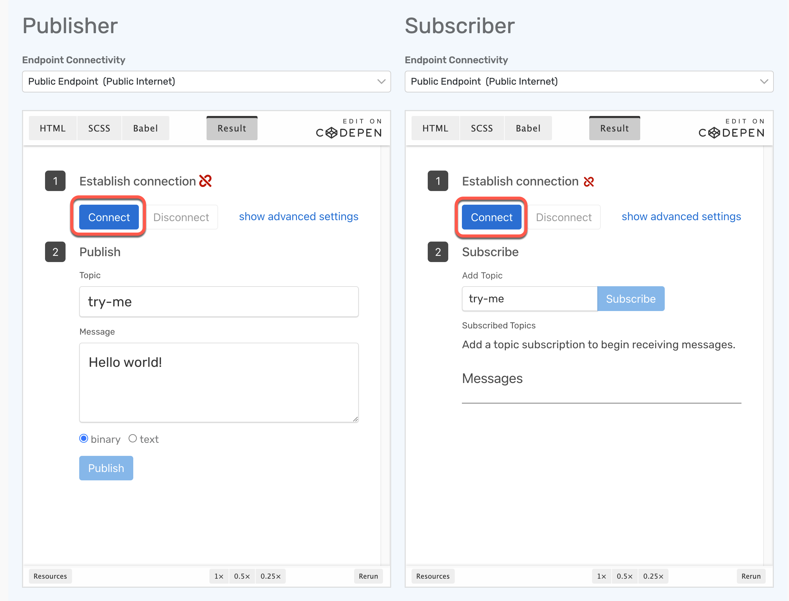
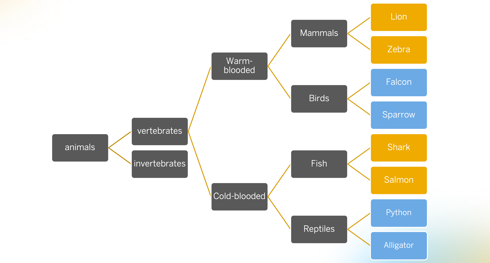
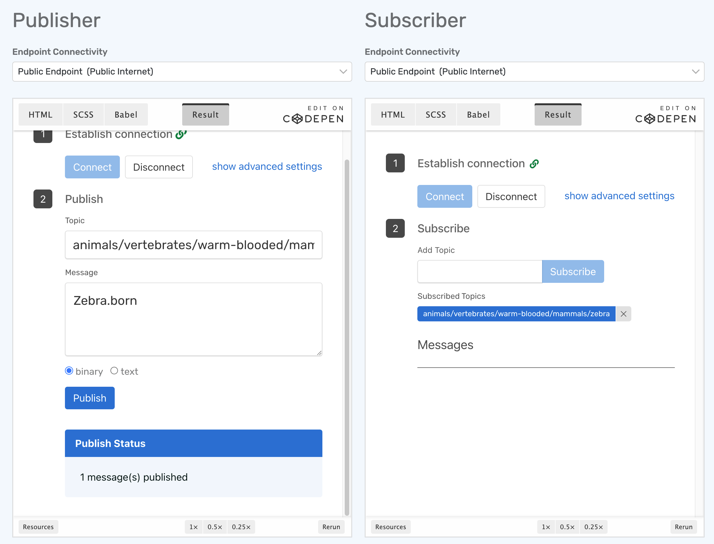
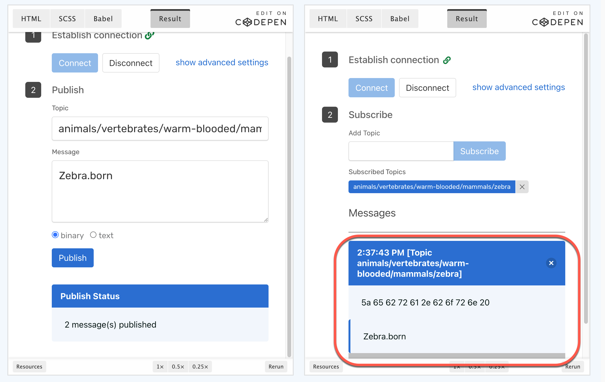
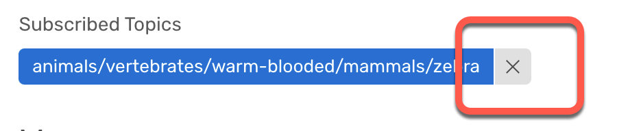
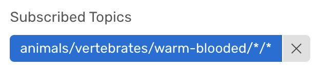
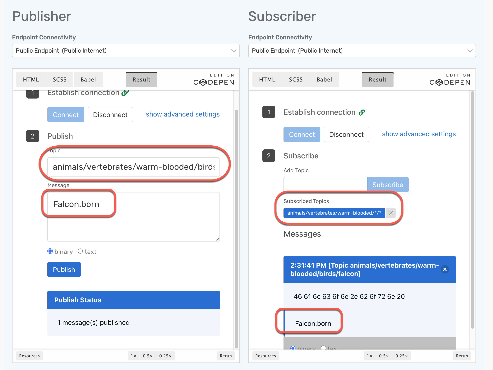

# Exercise 2 - Explore Topic Hierarchies and Wildcards

After completing these steps you will have learned about topic hierarchies and wildcards and how to use them

## Exercise 2.1 Learn about Topic Hierarchies and Wildcards

Advanced Event Mesh supports a hierarchical topic structure, which mean you can be very descriptive in defining your topic. Use it to describe the contents/intent of your message payload data. No need to use flat, coarse-grained topic labels like other brokers.

### Topics

Check out this seven minute video for more information: [All about AEM Topics](https://www.youtube.com/watch?v=PP1nNlgERQI)

Each and every message can be published to a unique topic, depending on the event metadata. Some examples of valid AEM topics are:

- hello/world/aem
- acme/taxi/rider/hail
- city/train/1234/alert/stopped
- mfg/plant42/inv/update/p12345667
- payme/debit/qr/bank01/f89a09-2b9c065a3/ok

### Subscription Wildcards

Because published topics can be so variable and dynamic, subscribers can use wildcards to match a single subscription to multiple published topics. AEM supports two different types of wildcards:

- Single-level wildcard, 0-or-more chars, matches up to the next level /.
     - Can be used with a prefix e.g.: abc*, but not a suffix.
- Multi-level wildcard, matches one-or-more levels.
     - Must occur at the end of the topic subscription.

Some examples of AEM topic subscriptions, and topics that they match:

## Exercise 2.2 Practice Topic Hierarchies and Wildcards using Try Me ! - Animal Edition

Now that we have learned about topic hierarchies and have a great tool like Try Me ! at hand. let's play around with topic hierarchies.

For that, we will use animal topics ...

1. Go to Try Me! - go to the cluster manager, click on your broker and then on Try Me!

2. In a next step connect both Publisher and Subscriber

Click on the connect buttons. Potentially you might still be connected from the last exercise.

Clean up your Subscribed Topics so that you are not subscribing to any topics any more.

3. Check out the hierarchical categorization of animals below

Now try out different combinations of publishing to a topic and listening to a topic and see which events you receive.

4. Register the consumer to listen to the Zebra topic - we just want to learn about Zebras geting born

For this subscribe the consumer to the topic animals/vertebrates/warm-blooded/mammals/zebra

5. Send a Zebra.born event to the topic animals/vertebrates/warm-blooded/mammals/zebra

Go to the Publisher, add Zebra.born to the message field, put animals/vertebrates/wam-blooded/mammals/zebra into the topic field and click Publish

You should receive the message.

6. Now we want to learn about all warm-blooded animals getting born

- Go to the Subscriber
- delete the topics your are listening to

- Subscribe to animals/vertebrates/warm-blooded/asteriks/asteriks

- Send a Falcon.born event to animals/vertebrates/warm-blooded/birds/falcon

7. Try out a few combinations on your own and see what works and what does not

To make this easier for you, find the topics below for copy and paste.

- animals/vertebrates/warm-blooded/mammals/lion
- animals/vertebrates/warm-blooded/mammals/zebra
- animals/vertebrates/warm-blooded/birds/falcon
- animals/vertebrates/warm-blooded/birds/sparrow
- animals/vertebrates/cold-blooded/fish/shark
- animals/vertebrates/cold-blooded/fish/salmon
- animals/vertebrates/cold-blooded/reptiles/python
- animals/vertebrates/cold-blooded/reptiles/alligator

## Summary

You've now explored topic hierarchies and wildcards.

Continue to - [Exercise 3 - Persistent and Non-Persistent Quality of Service](../ex3/README.md)
