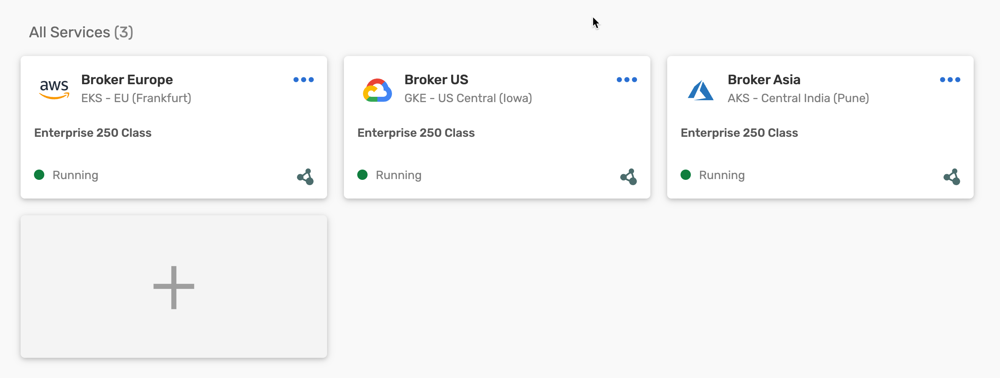
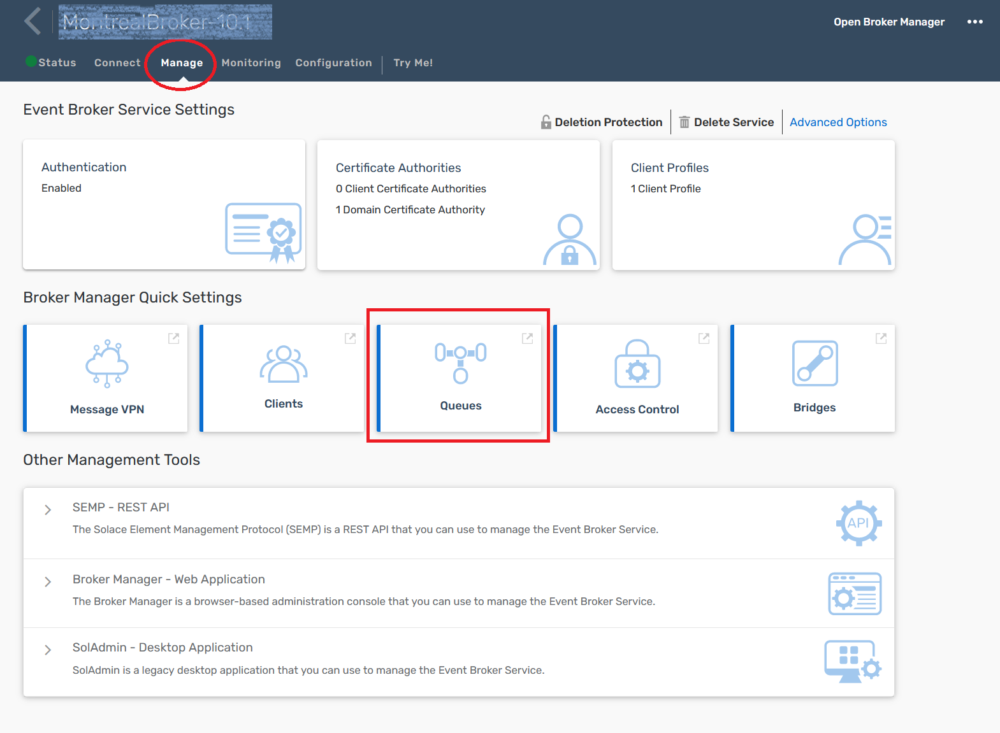

# Exercise 3 - Persistent and Non-Persistent

After completing these steps you will have learned about ...

## Exercise 3.1 Learn about delivery modes, persistency and quality of service

Advanced Event Mesh supports multiple delivery modes  for your events and messages. In this section we will explore what they are and how to use them.

### Persistence

Persistence refers to the Quality-of-Service (QoS) of event messages, which can be classified as Persistent (Guaranteed) or Non-Persistent.

Event Messages are considered persistent if they are placed onto non-volatile storage media after they arrive on the broker. The broker's Data Plane stores a message if the message arrives with the `Persistent Delivery Mode` set to `Persistent`, or if a queue or durable topic endpoint has subscribed to a topic where messages are persisted regardless of the `Persistent Delivery` Mode flag setting in the message.

If an event message is sent with `Persistent Delivery Mode` set to `Direct`, which is synonymous with `Non-Persistent`, the message is only placed onto the non-volatile storage media if the message is subscribed by a Queue or a Durable Topic Endpoint. Messages flagged as `Persistent` result in an acknowlegment message being sent back to the producer after the message is stored.

 In other words, AEM broker distinguish between the sender's persistency mode controlled by the flag on the message and the subscriber's persistency mode controlled by the existence or non-existence of a queue or topic-endpoint.

 If a publisher wants to make sure that they can detect (and react to) any messages being lost on the network, they should set the `Persistent Delivery Mode` to `Persistent` on the message they are publishing. This will cause the broker to acknowledge event messages it has successfully received (and processed) or sent an negative acknowledgement if anything went wrong.

 If a subscriber wants to make sure they do not loose any event messages, then they should always set up a queue (or topic endpoint) and add their subscription on that endpoint. We refer to this as topic to queue mapping. This will ensure that all event messages matching the subscriptions will be stored in the persistent endpoint on the broker and delivered to the consumer in a lossless/guaranteed way.
 Consumers are then expected to acknowledge the successful receipt of each message, after which (and only under that circumstance) the broker will remove the event message from the queue/endpoint.

 Persistent message delivery is also referred to by other names depending on the protocol or context, here are some synonyms and similar terms:
 - `Guaranteed Messaging`, `QoS1` (and `QoS2`), `at-least-once delivery` (and sometimes `exactly-once delivery`)

 Non-Persistent message delivery is also referred to by other names depending on the protocol or context, here are some synonyms and similar terms:
 - `Direct Messaging`, `QoS0`, `at-most-once delivery`

### Experimenting with Persistency

In this section we are going to play a bit around with persistency to see what this really means in a practical example using the broker's built-in Try-Me tab.

> Note, there are two different `Try-Me` tabs in AEM, one on the Cloud Console or cockpit on each service and one built into the admin UI of each broker service themself. You have used the former one previously. We are going to use the latter one now.

So, let's open up the broker UI's `Try-Me` tab next.

1. Go to the AEM Console and click on Cluster Manager.

2. Click on the same service you have used previously.

3. Go to the Management tab and click on the Queues tile.

13. Enter the topic into the field. Use BLR_topic_XXX as the topic, and replace XXX with your group/participant number.

20. Enter the queue name: BLR_*** (replace *** with your number)

## Summary

You've now explored topic hierarchies and wildcards.

Continue to - [Exercise 4 - Event Replay](../ex4/README.md)
