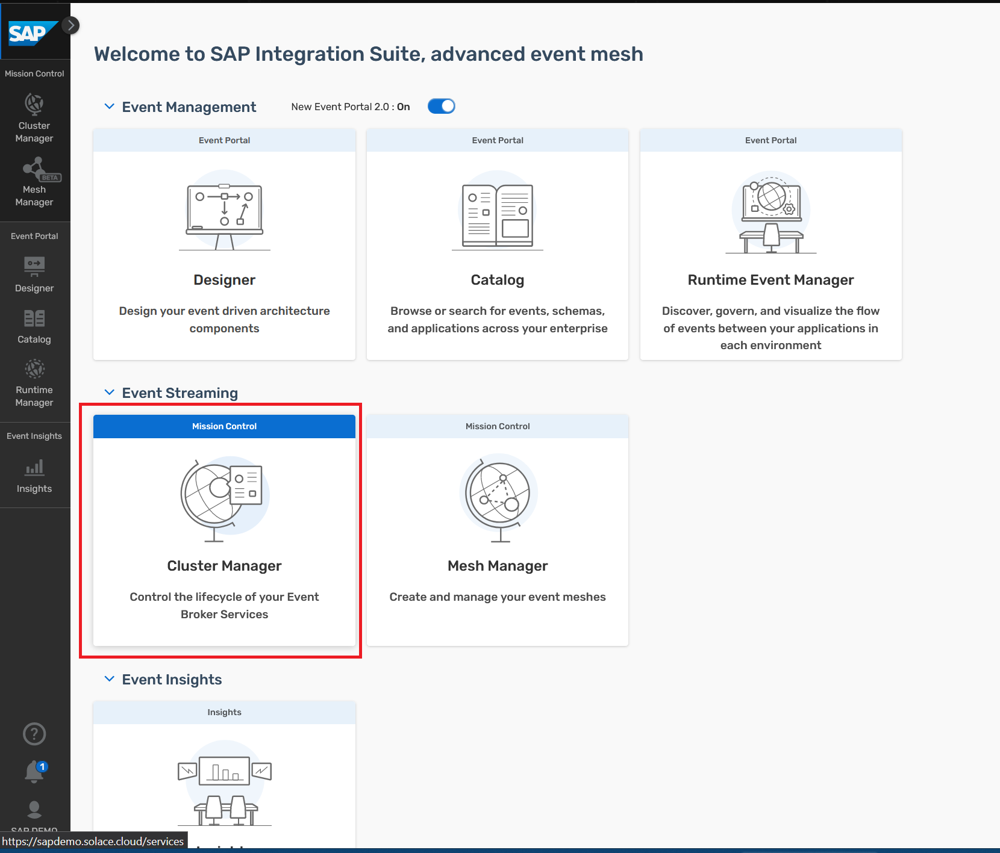
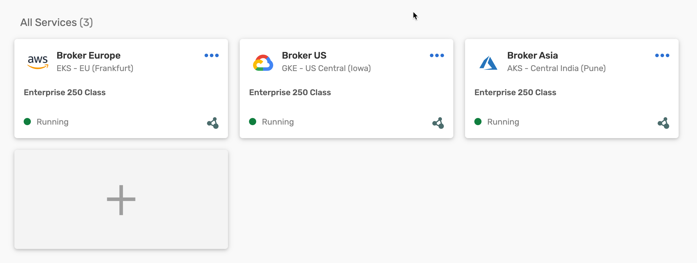
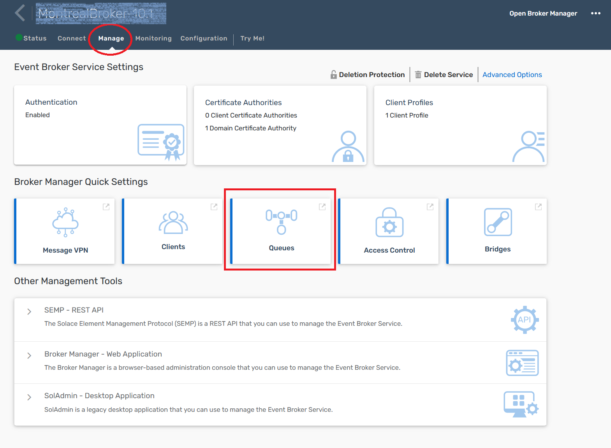
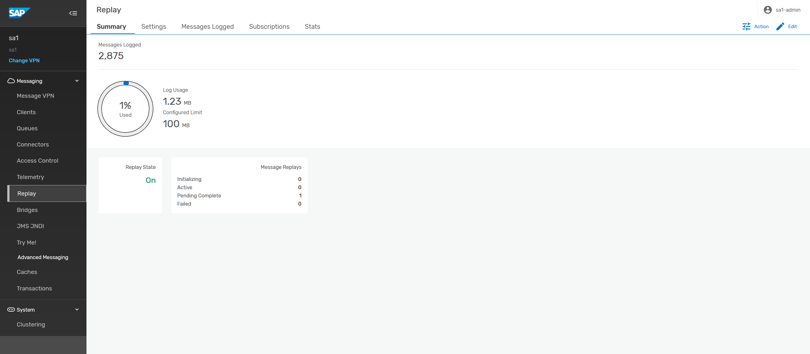
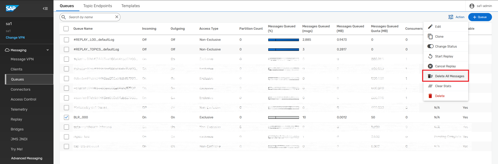
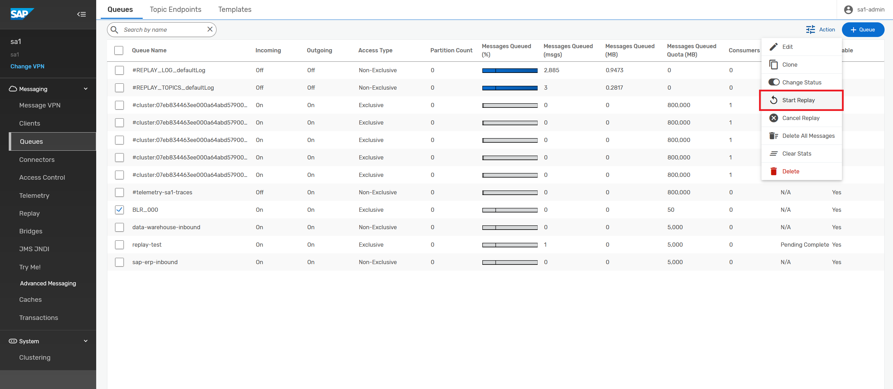
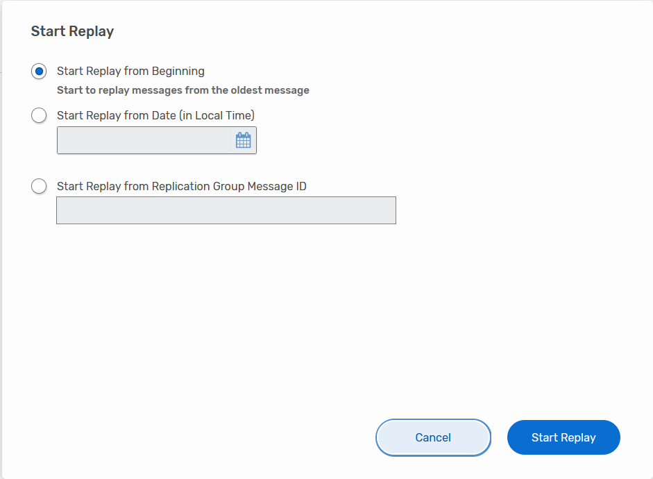
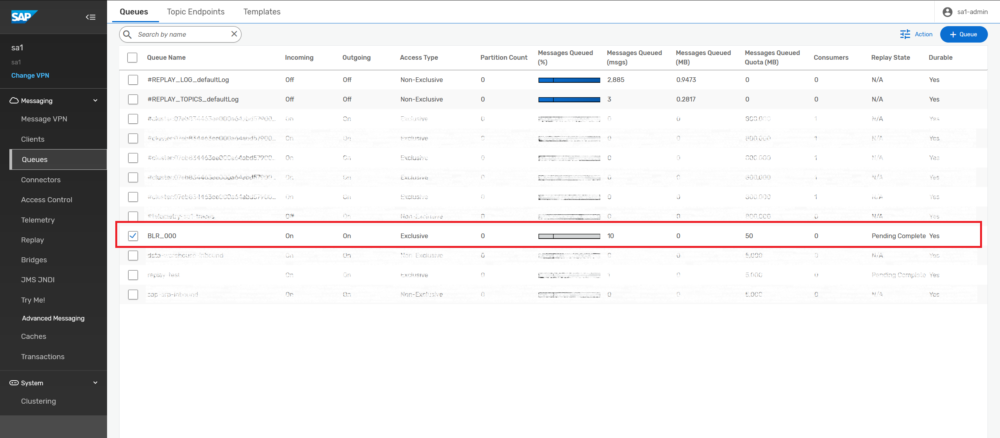
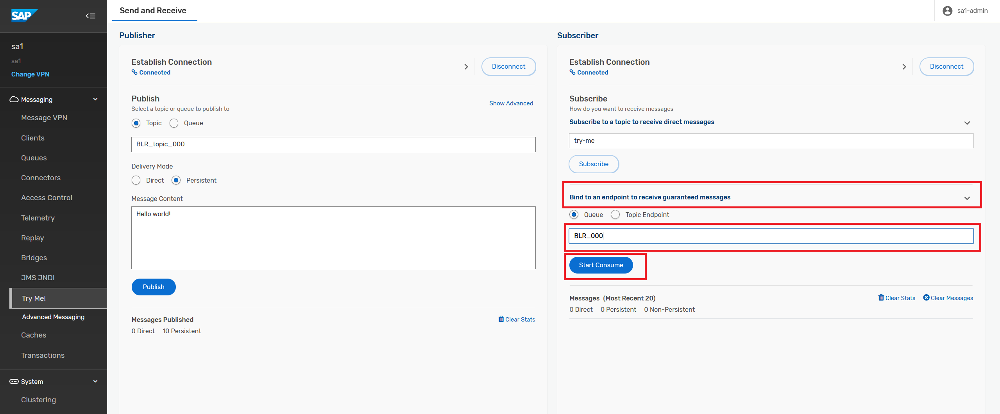

# Exercise 4 - Event Replay

After completing these steps you will have learned about AEM's replay functionality.

## Exercise 4.1 Learn about Replay

Message Replay is an AEM feature that allows an event broker to resend messages to new or existing clients that request them, hours or even days after those messages were first received by the event broker.

> Replay is not enabled by default, it has to be requested via support ticket.

With replay enabled, event brokers store persistent messages in a replay log. These messages are kept until the log is full, after which the oldest messages are removed to free-up space for new messages.

Replay can be performed on a (non-partitioned) queue or topic endpoint. When initiated, you can request all messages in the replay log, all messages following a specified replication group message ID, or all messages starting from a requested replay start time. From the requested starting point, the event broker will deliver, to the queue or topic endpoint, the messages from the replay log that match any subscription on that queue or topic endpoint.

## Exercise 4.2 Experimenting with Replay

1. Go to the AEM Console and click on Cluster Manager.

2. Click on the same service you have used previously.

3. Go to the Management tab and click on the Queues tile.

4. Click on Replay on the left hand menu to check that Replay is enabled.

> You should see a summary view with some stats on number of messages stored in the replay log and storage space allocated for replay. Feel free to explore some of the other tabs.

5. Return to the queue overview and find your queue, select and click on the action menu.

6. Select "Delete All Messages" to clear the queue.

> This will remove all currently stored messages from the queue and you will see the "Messages Queued" counter drop to zero for your queue.

7. Next, open the action menu again and select "Start Replay".

8. Select "Start Replay from Beginning" and hit "Start Replay".

9. You will return to the queue overview and replay for the queue will go to "Pending Complete".

> Some messages will start appearing in this queue as the broker is looking through the replay log for any messages matching the queue's subscription and placing them in this queue.

10. Let's head on over to our broker's `Try-Me` tab again and connect our queue consumer again.

> You should now see the messages you previously published and that you had already consumed appear again. How is that possible? 
Magic of Replay.

For more information about Replay and/or acknowledging messages, check the following links: 
[Message Replay](https://docs.solace.com/Overviews/Message-Replay-Overview.htm?Highlight=replay) 
[Acknowledging Messages](https://docs.solace.com/Solace-PubSub-Messaging-APIs/API-Developer-Guide/Acknowledging-Messages.htm)

## Summary

You've now explored Event Message Replay and seen how an adminstrator can replay messages that were published previously for a consumer.

Continue to - [Exercise 5 - Event-Driven in Action and Sample Architecture](../ex5/README.md)
